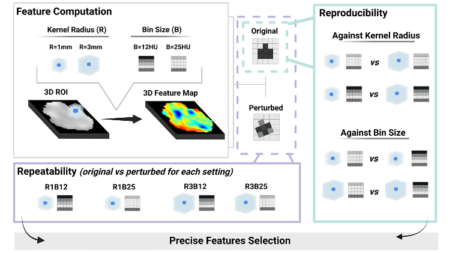

# Identification of Precise 3D CT Radiomics for Habitat Computation by Machine Learning in Cancer

This repository contains all code necessary to reproduce the study:  
**“Identification of Precise 3D CT Radiomics for Habitat Computation by Machine Learning in Cancer,”**  
published in *Radiology: Artificial Intelligence* (2024).  

📄 [Published paper](https://pubs.rsna.org/doi/10.1148/ryai.230118)  
⚠️ [Erratum](https://pubs.rsna.org/doi/10.1148/ryai.249001) correcting ICC equations in Appendix S6.  We thank Dr. Chien-Ming Chen for noticing the error.

The [`paper` folder](paper/Clean_SecondRevisionManuscript_withSupplCorrected.pdf) contains the full manuscript with figures and corrected supplementary materials.



---

## 1. Environment setup

To set up the environment, simply install the provided `requirements.txt`:

```bash
conda create -n precise-habitats python=3.9
conda activate precise-habitats
pip install -r requirements.txt
```

---

## 2. Steps to reproduce the paper

### Step 1 — Extract voxelwise (3D) radiomics with PyRadiomics
```bash
python compute_features_parallel.py
```
Parameter files for different kernel radii and bin sizes are in `feature_extraction/`.  
Example: For radius `3mm` and bin size `12HU`, use:  
```
radiomicsgroup/precise-habitats/feature_extraction/ROI_R3B12.yaml
```
### Step 2 — Compute habitats (cluster voxelwise features into tumor subregions)
```bash
python habitat_computation.py <LESION_ID> <RADIOMICS_DIR> <OUTPUT_DIR>
```

### Step 3 — Assess habitat stability (compute Dice between original and perturbed)
```bash
python habitat_stability.py
```

### Step 4 — Repeatability (test–retest analysis)
```bash
python metrics_repeat.py --testROI /path/original_R1B12/<LESION>                          --retestROI /path/perturbed_R1B12/<LESION>                          --exclude glcm_MCC                          --odir /path/to/repeat_csv
```
Combine results:
```bash
python combine_csv.py /path/to/repeat_csv /path/to/repeatability_cohort.csv
```

### Step 5 — Reproducibility (across different R and B settings)
```bash
python metrics_repro.py --firstROI /path/original_R1B12/<LESION>                         --secondROI /path/original_R3B12/<LESION>                         --exclude glcm_MCC                         --odir /path/to/repro_csv
```
Combine results:
```bash
python combine_csv.py /path/to/repro_csv /path/to/reproducibility_cohort.csv
```

### Step 6 — Analyze cohort-level results and generate figures
Use the provided notebooks:
- `precision_analysis/analysis_repeat.ipynb`
- `precision_analysis/analysis_repro.ipynb`

---


## 3. Citation
If you find any of these codes useful for your research and applications, please cite us:

```
Prior O, Macarro C, Navarro V, et al.
Identification of Precise 3D CT Radiomics for Habitat Computation by Machine Learning in Cancer.
Radiol Artif Intell. 2024;6(2):e230118.
```

---

## 4. Contact
If you have questions please contact:
- Dr. Raquel Perez-Lopez — rperez@vhio.net  
- Olivia Prior — oliviaprior@vhio.net  

More info:  
- [Radiomics Group](https://radiomicsgroup.github.io/)  
- [VHIO](https://vhio.net/)
